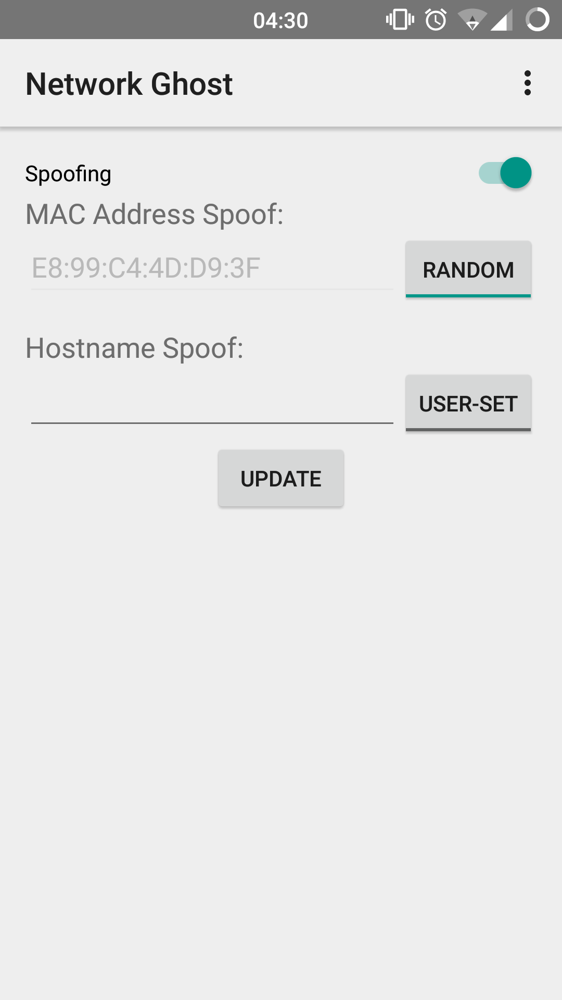

# Network Ghost

Android MAC/Hostname Spoofing in Lollipop 5.1 (And probably older Androids too) (tested on Galaxy S4 and HTC One M7/M9 w/ cyanogenmod 12.1)

Change your mac address! Change your hostname! Fun for all the family! *

\* May not actually be true.



## What is it?
An app that allows for randomising MAC addresses and hostnames on an android device. May not work with every android device around - try it out to see if it works!

YOU NEED ROOT FOR THIS APP.

## Why?
I got *really* fed up with miscellaneous forum posts which all say "run this busybox command" or "try this mystical app that works even though this one doesnt" and bizarre obscure errors that some people got and other ignored.

Furthermore, MAC spoofing was *very* easy in the 4.0/4.1 era through a simple busybox command, but 4.2 onwards I kept getting a "WPA: 4-way handshake failed" error in logcat. Very mysterious.

Pry-Fi worked in 4.4, but also would not let me *just* randomise my mac address when connecting to a network without the whole swapping out saved network lists. It also stopped working (for me at least) in 5.0.

Finally, there seems to be a distinct lack of open source apps that let me change the MAC address. I hope this can change that.

## Where does it definitely work?
* Samsung Galaxy S4 running Cyanogenmod 12.1
* HTC One M7
* HTC One M9

NOTE: Some MAC addresses cannot be set. For example, "11:22:33:44:55:66" will not work on my S4 but "00:11:22:33:44:55" will.

## How do I get it?
Install the apk file!

## How do I use it?
Open up the app, flip the spoof switch. You will be asked to okay an update to /system files to allow this to work.

Hit the toggle button to change "User-set" to "randomise" and hit "update". Verify the mac has really been changed to what the app says by opening up a terminal and running:
```
adb shell ip addr
```
If you see something like:
```
4: wlan0: <NO-CARRIER,BROADCAST,MULTICAST,UP,LOWER_UP> mtu 1500 qdisc pfifo_fast state DORMANT qlen 1000
link/ether 00:11:22:33:44:55 brd ff:ff:ff:ff:ff:ff
```
Where 00:11:22:33:44:55 is whatever is in the MAC address box in the app... Then you win! Now try and connect to a wifi network!

If the toggle is set to user-set, the mac address you enter is set everytime the wifi turns on (NOTE: the wifi will turn on, off and back on again and this is normal).

## Can I change MAC addresses programatically? (e.g. from another app or from tasker?)
Yes! Send an intent. Currently, you could send:
* com.moosd.netghost.RANDOMISE_MAC - This forces a random MAC to be used right now.
* com.moosd.netghost.SET_MAC_STATIC - This forces a given MAC to be used right now. The mac address should be supplied in an extra called "mac".
* com.moosd.netghost.SET_MAC_ONESHOT - This forces a given MAC to be used right now, and don't remember it for next time. This means you can change the mac temporarily until the next time wifi is turned off and on again. The mac address should be supplied in an extra called "mac".

To use this from tasker:

1. Open the task you want to add mac-changing magic to.
2. Add a new "Send Intent" action (search for send intent in the search box)
3. Set the "Action" to one of the intents mentioned above, e.g. com.moosd.netghost.SET_MAC_ONESHOT
4. Set the Extra field to "mac:00:11:22:33:44:55" (without the quotes and replace the 00:11:22:33:44:55 with the mac you want to change to)
5. Save it and run it to test if needed.
6. ???
7. Profit!

## How does this magic work if the busybox command doesn't work for wpa connections???
Before 4.2, it was possible to change the mac address by entering in something like:
```
busybox ifconfig wlan0 down
busybox ifconfig wlan0 hw ether 00:11:22:33:44:55
busybox ifconfig wlan0 up
```
But afterwards, doing this will result in the mac address being changed in "ip addr". However, wpa_supplicant will continue to use the old mac address. (Test this using wpa_cli!) And simply killall wpa_supplicant messes up the wifi subsystem until you turn wifi off and on again (wpa_supplicant is used to authenticate with the wpa network!). And this resets the mac address!

After much head-banging and frustration, I figured out that instead of
```
busybox ifconfig wlan0 down
```
It was necessary to turn it off the Android(TM) way, i.e.
```
svc wifi disable
```
Which kills wpa_supplicant, allowing us to swap out the mac address and turn wifi back on (which restarts wpa_supplicant, forcing it to re-read the mac address into memory).

But some devices bring down the network interface when the wifi is turned off, not letting us change the mac address. And when it's brought back up, wpa_supplicant is started up and the mac address is locked in again! What a travesty!

But it's okay, I've come up with a workaround. This app will now install the workaround into /system and this new method should be more portable across devices.

I have kept the commands running in a root shell to a minimum, since the wifi start/stop can be achieved in java.
